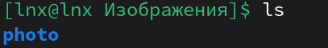
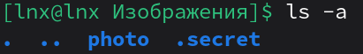
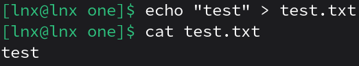
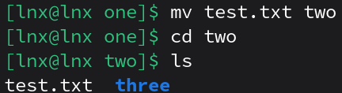
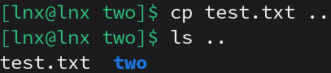
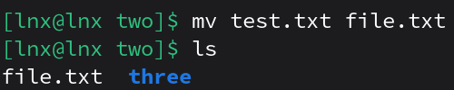
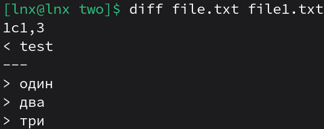
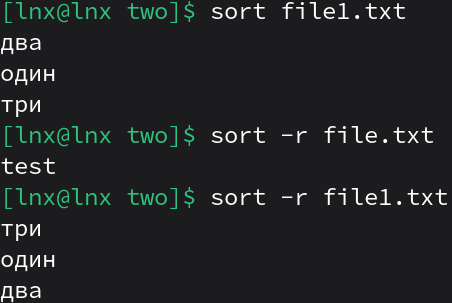
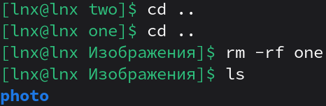

1. Переместиться между директориями

2. Вывести список файлов в директории

3. Вывести список Всех файлов в директории

4. Создать папку с подпапками

5. Внутри папки создать файлик и записать в него что-нибудь

6. Переместить файл из одно директории в другую

7. скопировать файл из одной директории в другую

8. переименовать файл

9.  сравнить содержимое файла

10.  отсортировать содержимоей файла по возрастанию и убыванию

11. удалить все папки и файлы
