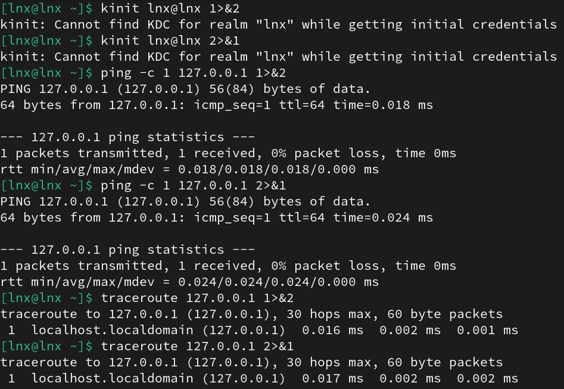

1. Как работают команды >,>>?
```
> file — направить стандартный поток вывода в файл. Если файл не существует, он будет создан, если существует — перезаписан сверху.
>> file — направить стандартный поток вывода в файл. Если файл не существует, он будет создан, если существует — данные будут дописаны к нему в конец.
```
2. Что такое перенаправление ввода? stderr,stdout;
```
Из стандартного ввода команда может только считывать данные. Потоки можно подключать к чему угодно: к файлам, программам и даже устройствам. В командном интерпретаторе bash такая операция называется перенаправлением.
< file — использовать файл как источник данных для стандартного потока ввода.

Два других потока могут использоваться только для записи.
stdout — стандартный вывод,
stderr — стандартная ошибка.
```
3. Выести содержание файла не используя текстовые редакторы;
``` bash
cat file.txt
```
4. Создать файл с содержимым не используя текстовые редактор;
``` bash
echo "test" > file.txt
```
5. пернеаправить stdout в stderr и обратно на примере команды kinit, ping, tracert

6. чем отличаются stdout и stderr
```
stdout используется для обычного вывода данных, а stderr для ошибок и предупреждений.
Их можно направлять в разные места в зависимости от задачи, чтобы не смешивать ошибки с результатами.
```
7. что такое stdin?
```
Стандартный ввод при работе пользователя в терминале передается через клавиатуру.
stdin — стандартный ввод (клавиатура). Из стандартного ввода команда может только считывать данные.
```
8. как отправить весь вывод команды в пустоту?
```
Отправить только stdout:
команда > /dev/null
Отправить только stderr:
команда 2> /dev/null
Отправить stdout и stderr одновременно:
команда > /dev/null 2>&1
```