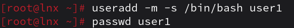
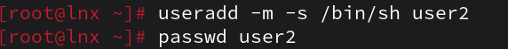
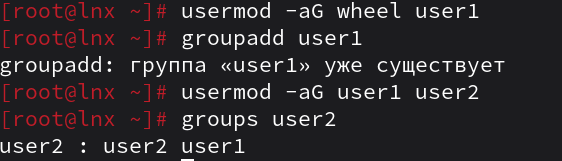
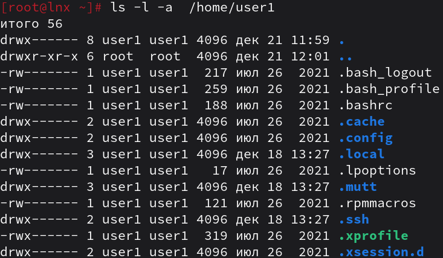
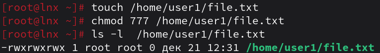
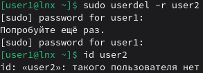
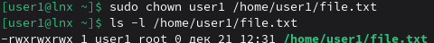

1. Добавьте пользователей user1 и user2:
    1.1) user1 - оболочка bash
    1.2) user2 - оболочка sh
    1.3) установите им пароли



2. Назначьте пользователю 1 группу администраторов, польователя 2 добавте в группу пользователя 1

3. Что такое права доступа? Выведите права доступа на файлы в директории пользователя
```
Права доступа в Linux делятся на 3 вида
r - чтение
w - запись
x - выполнение
Каждый из этих типов отдельно применяется для создателя, группы и остальных пользователей.
```

4. Как изменить права на файлы? Создайте файл который будет на который у всез пользователей будут все возможные права
```bash
chmod [права] [путь]
```

5. Как называется учётная запись встренного администратора в linux?
```
root
```
6. Как выполнить команду от имени администратора?
```bash
sudo [команда]
```
7. Есть ли ограничения у суперпользователя?
```
нет, за исключением аппаратных
```
8. Удалите пользователя 2 с помощью пользователя 1.

9.  Как можно изменить владельца папки? измените владельца папки из пункта 4
```bash
sudo chown [пользователь] [путь]
```
>! в пункте 4 создовался файл, а не папка. Далее будет изменён владелец для файла.
