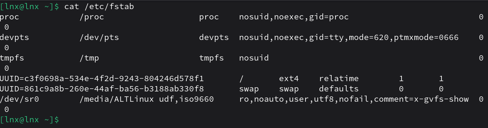
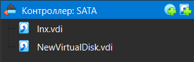
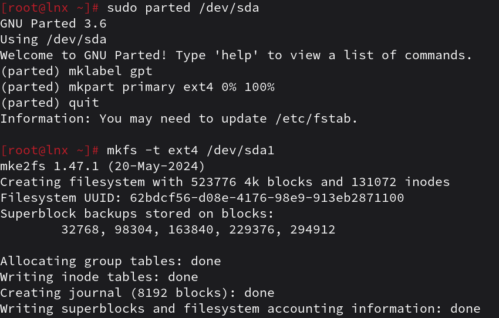
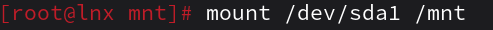
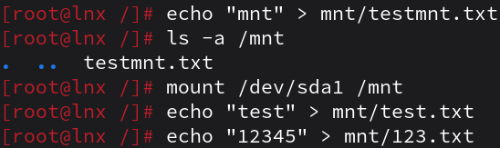
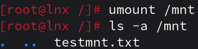
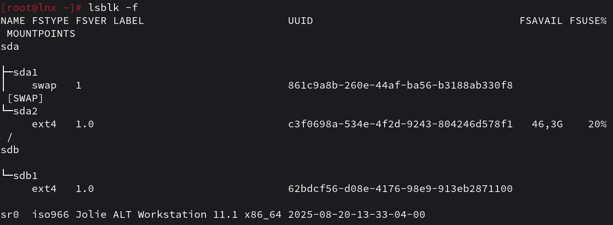
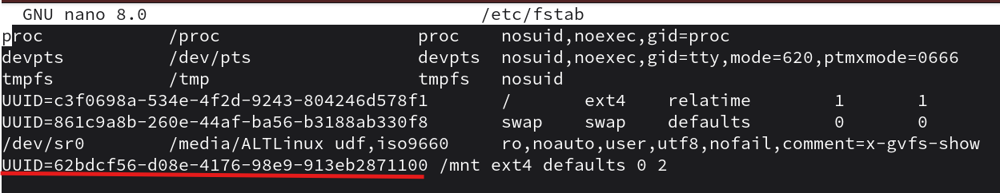
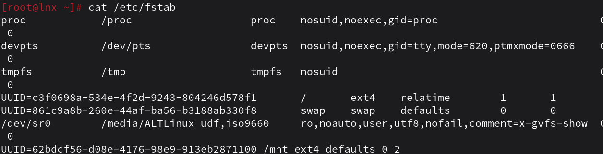
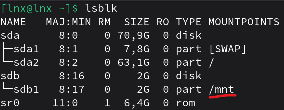

1. Выведите содержимое fstab. Что хранится в fstab?

```
В /etc/fstab хранится список всех дисков, разделов, swap и виртуальных файловых систем с указанием, куда они монтируются, какой у них тип файловой системы, с какими параметрами монтирования, а также с настройками для проверки файловой системы при загрузке.
```
2. Добавьте в виртуальную машину ещё один диск

3. Узнайте как ситема видит ваш диск - выведите информацию о блочных устройствах
```bash
lsblk
sda      8:0    0    2G  0 disk 
sdb      8:16   0 70,9G  0 disk 
├─sdb1   8:17   0  7,8G  0 part [SWAP]
└─sdb2   8:18   0 63,1G  0 part /
sr0     11:0    1  6,4G  0 rom 
```
4. С помощью полученной информации создайте на диске таблицу разделов и фаловую систему ext4

5. Примонитруте диск в каталог /mnt

6. Зайдите в каталог и создайте там файлы

7. Отмонтируйте диск и проверье остались ли файлы

```
Вернулся файл, который был создан до монтирования, а которы были созданы в монтируемомом диске, пропали.
```
8. Сделайте так чтобы диск автоматически подключался при загрузке систем ( добавьте информацию о нём с fstab)


9.  Проверьте корретность записанных в fstab данных перед перезагрузкой

10.  Перезагрущите систему и убедитесь что диск был подключён к системе
