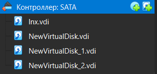
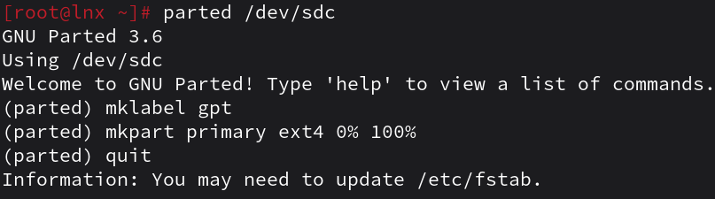
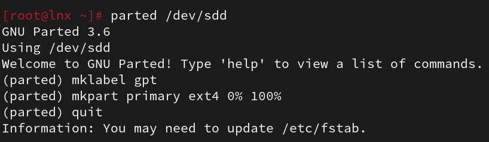
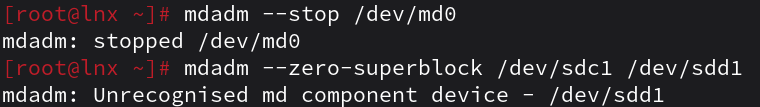
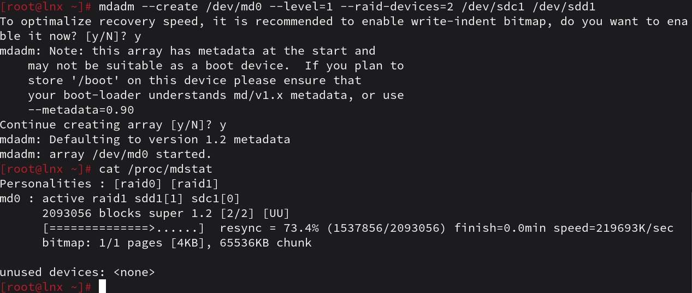

RAID (англ. Redundant Array of Independent Disks — избыточный массив независимых (самостоятельных) дисков) — технология виртуализации данных для объединения нескольких физических дисковых устройств в логический модуль для повышения отказоустойчивости и (или) производительности.
1. Raid массивы, что такое икакие бывают
```
RAID — технология виртуализации данных для объединения нескольких физических дисковых устройств в логический модуль для повышения отказоустойчивости и/или производительности.

RAID 0  — дисковый массив из двух или более жёстких дисков без резервирования. Информация разбивается на блоки данных фиксированной длины и записывается на оба/несколько дисков поочередно. Скорость считывания файлов увеличивается в число подключёных дисков. Увеличивается риск потери данных по причине отказа одного из устройств массива.

RAID 1 — массив из двух дисков, являющихся полными копиями друг друга. Имеет высокую надёжность — работает до тех пор, пока функционирует хотя бы один диск в массиве.

RAID 5 — дисковый массив с чередованием блоков данных и контролем чётности. При выходе из строя одного диска надёжность тома сразу снижается до уровня RAID 0 с соответствующим количеством дисков n−1. Минимальное количество используемых дисков равно трём.

RAID 6 — массив из четырёх или более дисков с проверкой чётности, разработанный для защиты от потери данных при выходе из строя сразу двух жёстких дисков в массиве. Максимальная надёжность из всех массивов данных RAID. Относительно большие затраты и потери в производительности по сравнению с RAID 5. Производительность RAID 6 — самая низкая среди всех массивов RAID.

RAID 10 (RAID 1+0) — зеркалированный массив, данные в котором записываются последовательно на несколько дисков, как в RAID 0. Эта архитектура представляет собой массив типа RAID 0, сегментами которого вместо отдельных дисков являются массивы RAID 1. RAID 10 объединяет в себе высокую отказоустойчивость и производительность. RAID 10 будет выведен из строя только после выхода из строя всех накопителей в одном и том же массиве RAID 1.
```
2. Добавьте в виртуальную машину 2 диска отформатируйте их в ext4



3. Создайте из них raid 0 массив
```bash
[root@lnx ~]# mdadm --create /dev/md0 --level=0 --raid-devices=2 /dev/sdc1 /dev/sdd1
mdadm: Defaulting to version 1.2 metadata
mdadm: array /dev/md0 started.
```
4. Проверье всё ли работает
```bash
[root@lnx ~]# cat /proc/mdstat
Personalities : [raid0] 
md0 : active raid0 sdd1[1] sdc1[0]
      4186112 blocks super 1.2 512k chunks
      
unused devices: <none>
```
5. Удалите raid0 и создайте raid1


6. В чём между ними разница?
```
RAID 0 имеет повышеную скорость, но пониженую надёжность, а RAID 1 имеет приемлимую скорость и повышенную надёжность.
```
7. Есть ли файловые системы которые поддерживают raid массивы без стороненго ПО
```
Да, например Btrfs
```
8. Можно ли создать raid массив во время установки системы?
```
Да, используя ПО можно создать raid массив во время установки системы, например для корневого раздела.
```