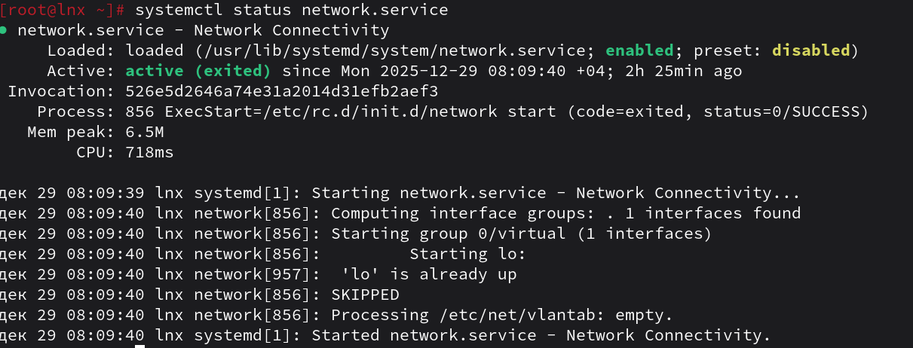
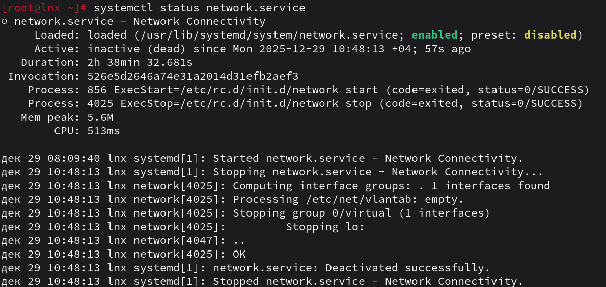
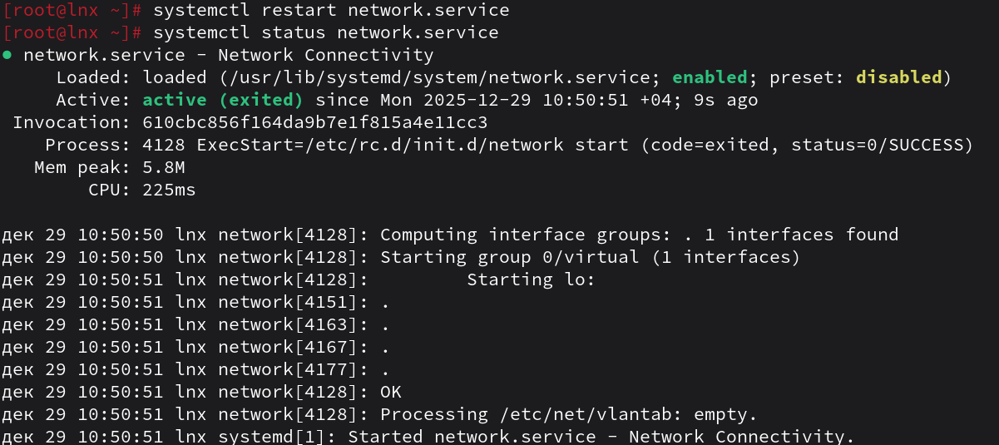
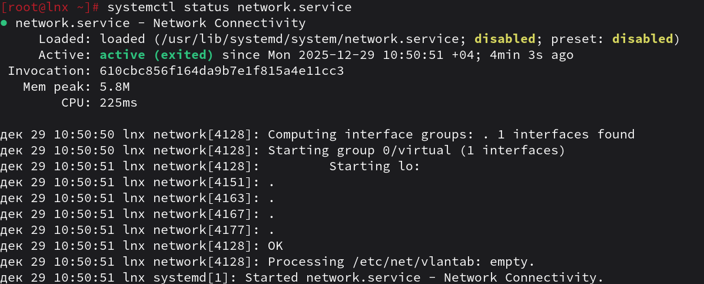
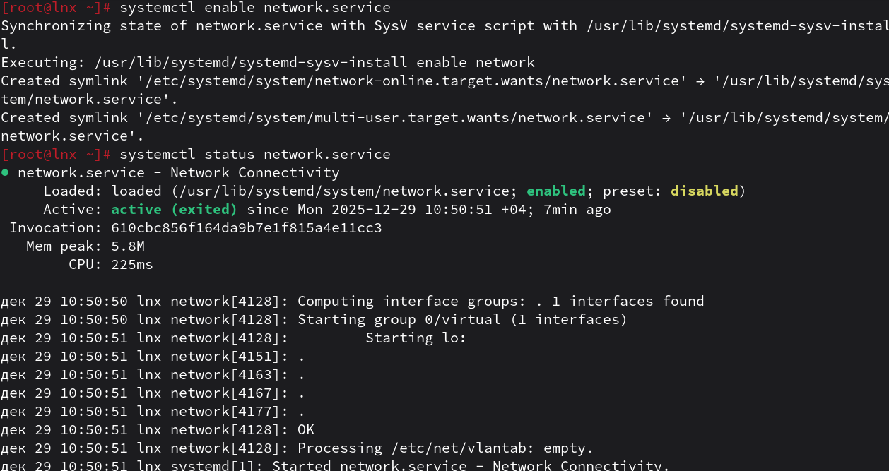

1. Что такое systemd юнит?
```
systemd юнит - это описательный файл, который говорит systemd как запускать/останавливать/управлять каким-либо ресурсом.
```
2. Проверье статус любого systemd юнита, какую информацию выводит эта кманда?

Эта команда выводит загрузку, состояние, различные дополнительные сведенья и журнал последних событий
3. ПОпробуйте оставновить сервис.

4. Перезапустите его.

5. УДалите из автозагрузки

6. Верните обратно

7. Что такое таймеры?
```
timer - юнит, который запускает другой юнит по расписанию или через определённые интервалы.
```